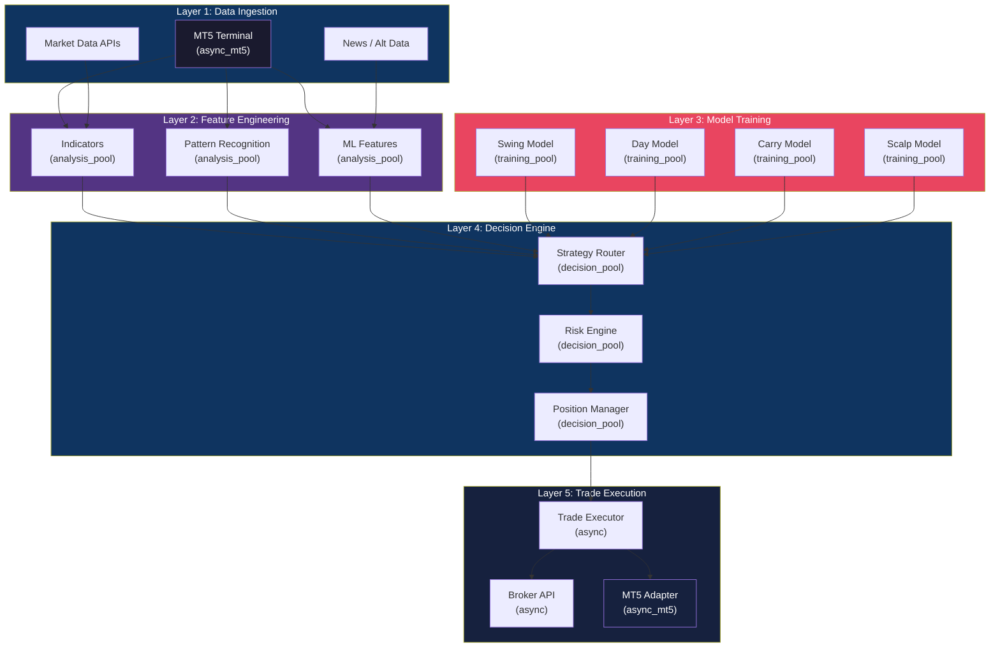
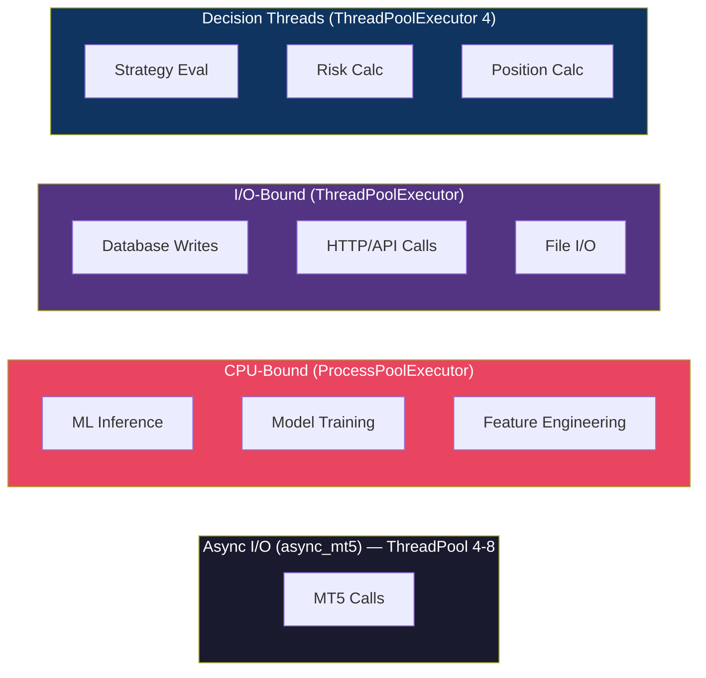
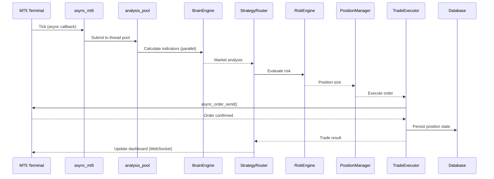
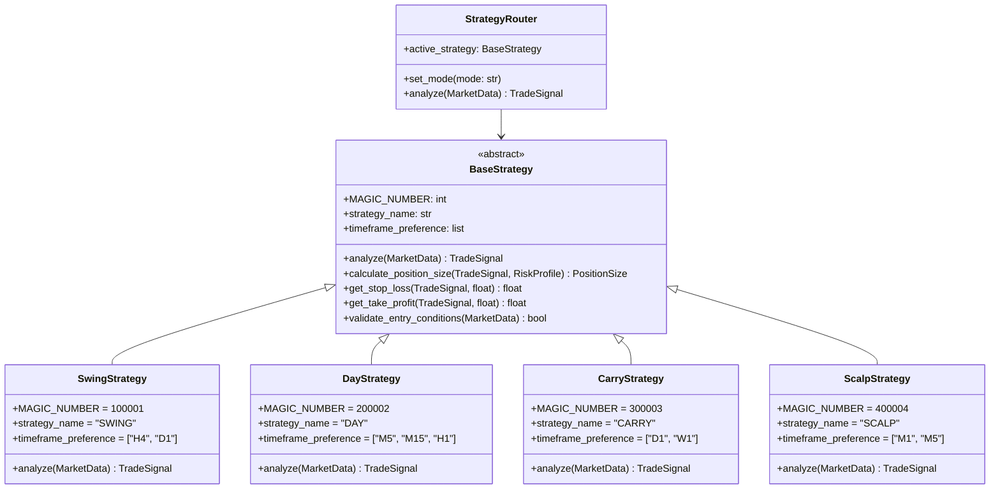
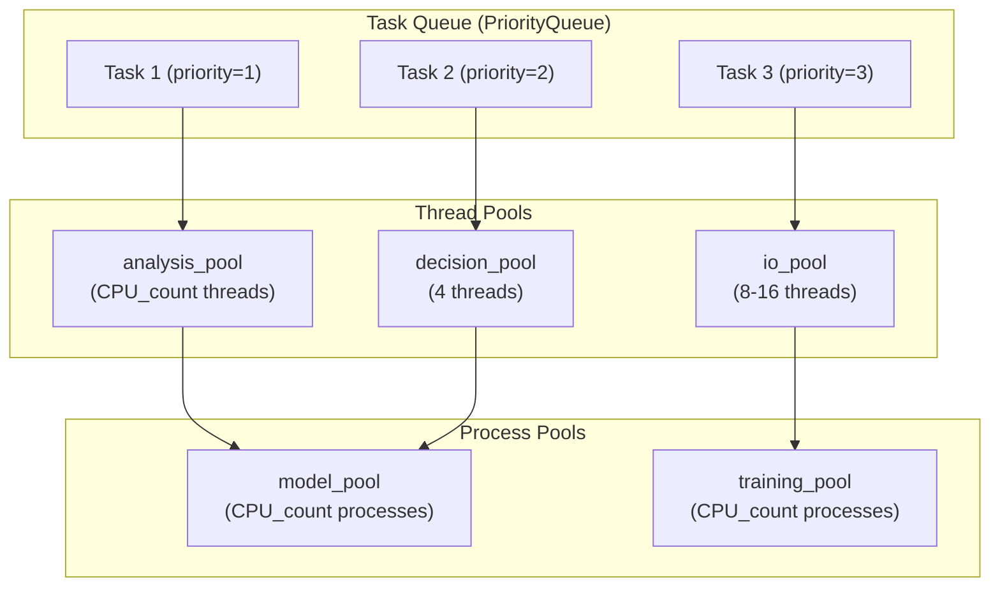
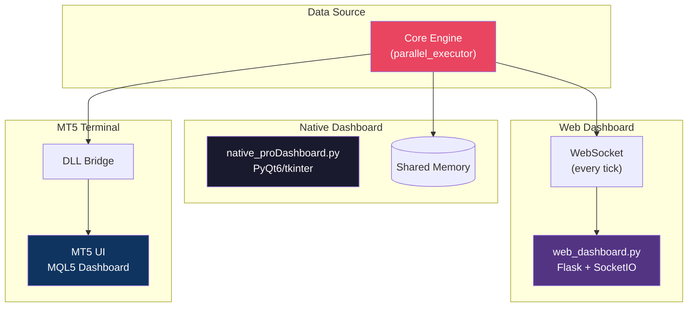
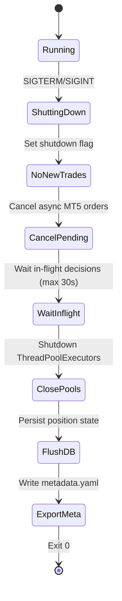
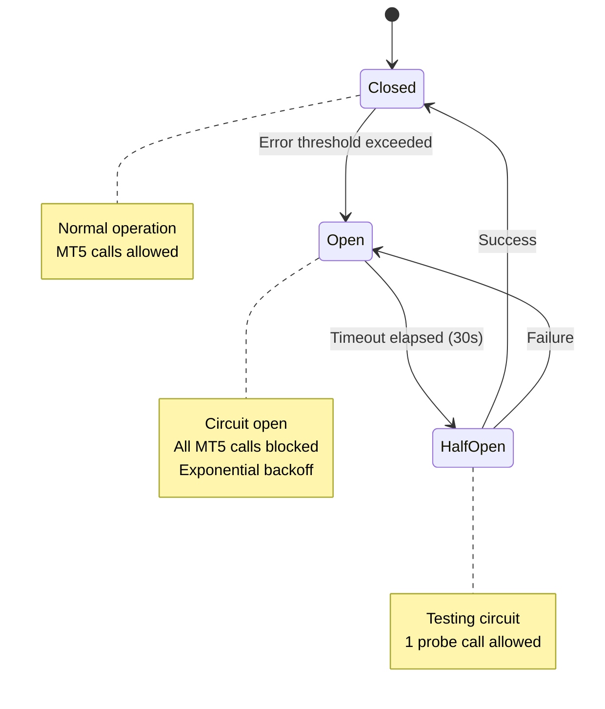

# AFX AutoTrader v2 — Architecture Diagrams
# Mermaid-format diagrams for system visualization

## 1. Five-Layer System Architecture

## 2. Threading Model

## 3. Trade Execution Flow

## 4. Strategy Inheritance

## 5. Parallel Executor Architecture

## 6. Dashboard Architecture

## 7. Graceful Shutdown

## 8. Circuit Breaker Pattern

